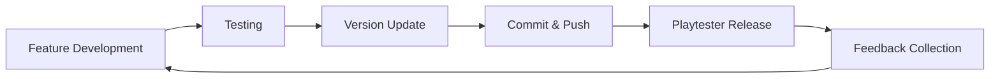

# Development Workflow Guide

**Rogue Resident - Version Management & Development Process**

This guide outlines the complete development workflow for Rogue Resident, focusing on version management, commit practices, and playtester communication.

## 📋 Table of Contents

1. [Overview](#overview)
2. [Development Workflow](#development-workflow)
3. [Version Management](#version-management)
4. [Commit Guidelines](#commit-guidelines)
5. [Feature Development Process](#feature-development-process)
6. [Playtester Communication](#playtester-communication)
7. [Release Process](#release-process)
8. [Troubleshooting](#troubleshooting)

## Overview

The Rogue Resident development workflow integrates seamlessly with the existing architecture patterns and provides clear processes for:

- **Version Management**: Automated versioning with changelog generation
- **Commit Standards**: Consistent, meaningful commit messages
- **Playtester Communication**: Visible updates through in-game notifications
- **Release Documentation**: Automated changelog and version tracking

### Integration with Existing Systems

This workflow complements the existing documentation structure:
- **Architecture Patterns** (`architecture-patterns.md`) - Technical implementation patterns
- **PWA Guide** (`rogue-resident-pwa-guide.md`) - Progressive web app features
- **Theme System** (`THEME.md`) - Visual design consistency
- **PBC Dev Guide** (`pbc-dev-guide.md`) - Problem-based curriculum development

## Development Workflow

### Standard Development Cycle



### Daily Development Process

1. **Start Development Session**
   ```bash
   git pull origin main
   npm run dev
   ```

2. **Implement Changes**
   - Follow architecture patterns from `architecture-patterns.md`
   - Maintain theme consistency per `THEME.md`
   - Update relevant documentation

3. **Test Changes**
   - Verify functionality in development server
   - Test on multiple devices/browsers
   - Check visual consistency

4. **Update Version & Changelog**
   - Choose appropriate version bump type
   - Write user-friendly changelog entry
   - Update version information

5. **Commit & Push**
   - Follow commit message guidelines
   - Include relevant issue references
   - Push to appropriate branch

## Version Management

### Version Bump Types

| Type | When to Use | Example |
|------|-------------|---------|
| **Patch** | Bug fixes, minor tweaks | `0.1.0 → 0.1.1` |
| **Minor** | New features, improvements | `0.1.0 → 0.2.0` |
| **Major** | Breaking changes, overhauls | `0.1.0 → 1.0.0` |

### Using the Version Management System

#### Quick Updates (Recommended)
```bash
# Bug fix
npm run version:patch "Fixed constellation star alignment issue"

# New feature
npm run version:minor "Added mentor relationship progression system"

# Major update
npm run version:major "Redesigned hospital navigation interface"
```

#### Manual Script Usage
```bash
node scripts/update-version.js patch "Description of changes"
```

#### Complex Updates
For updates with multiple changes, manually edit `app/utils/versionManager.ts`:

```typescript
{
  version: "v0.2.0-dev",
  date: "2024-12-19",
  type: "minor",
  highlights: [
    "New mentor relationship system",
    "Enhanced hospital navigation",
    "Improved performance optimizations"
  ],
  changes: [
    "Added comprehensive mentor relationship progression with visual indicators",
    "Implemented smooth hospital room transitions with isometric perspective",
    "Enhanced TPS visualization with real-time dose calculations",
    "Optimized constellation rendering for better performance on mobile devices",
    "Fixed various UI inconsistencies reported by playtesters",
    "Updated pixel art assets for better visual clarity"
  ]
}
```

## Commit Guidelines

### Commit Message Format

```
<type>(<scope>): <subject>

<body>

<footer>
```

#### Types
- **feat**: New feature for users
- **fix**: Bug fix for users
- **docs**: Documentation changes
- **style**: Code formatting, missing semicolons, etc.
- **refactor**: Code restructuring without feature changes
- **test**: Adding or updating tests
- **chore**: Build process or auxiliary tool changes

#### Scopes (Optional)
- **ui**: User interface components
- **game**: Core game logic
- **data**: Game content and data
- **build**: Build system changes
- **docs**: Documentation updates

#### Examples

```bash
# Feature addition
git commit -m "feat(ui): add changelog popup to title screen

- Implemented ChangelogPopup component with themed styling
- Added 'What's New' button with conditional 'New' badge
- Integrated with version management system
- Added smooth animations and responsive design

Closes #123"

# Bug fix
git commit -m "fix(game): resolve constellation positioning issue

- Fixed star alignment in knowledge constellation view
- Updated positioning calculations for different screen sizes
- Added bounds checking for star placement

Fixes #456"

# Documentation update
git commit -m "docs: add development workflow guide

- Created comprehensive workflow documentation
- Added version management process
- Included commit guidelines and examples
- Updated static documentation structure"
```

## Feature Development Process

### 1. Planning Phase
- Review existing architecture patterns
- Check theme consistency requirements
- Plan user experience impact
- Consider playtester feedback

### 2. Implementation Phase
```bash
# Create feature branch (optional for small features)
git checkout -b feature/mentor-relationships

# Implement following architecture patterns
# Reference: docs/static/architecture-patterns.md
```

### 3. Testing Phase
```bash
# Start development server
npm run dev

# Test across different devices
# Verify theme consistency
# Check performance impact
```

### 4. Documentation Phase
- Update relevant component documentation
- Add inline code comments
- Update architectural diagrams if needed
- Prepare changelog entries

### 5. Version & Release Phase
```bash
# Update version with appropriate type
npm run version:minor "Added mentor relationship system"

# Commit with proper message format
git add .
git commit -m "feat(game): implement mentor relationship progression

- Added relationship tracking system with visual indicators
- Implemented relationship events and dialogue integration
- Created mentor-specific interaction patterns
- Updated UI components for relationship display

References #789"

# Push to main (or merge feature branch)
git push origin main
```

## Playtester Communication

### In-Game Notifications
The version management system automatically provides:

- **"What's New" Button**: Visible on title screen
- **"New" Badge**: Appears for updates within 7 days
- **Changelog Popup**: User-friendly display of recent changes
- **Version Display**: Current version shown on title screen

### Writing Effective Changelog Entries

#### Good Examples ✅
```
"Added interactive mentor dialogue system with branching conversations"
"Fixed constellation stars disappearing on mobile devices"
"Improved hospital room loading times by 40%"
"Enhanced pixel art clarity for better readability"
```

#### Poor Examples ❌
```
"Updated mentor system" (too vague)
"Fixed bug in constellation.tsx line 45" (too technical)
"Refactored state management" (not user-facing)
"Various improvements" (not specific)
```

#### Best Practices
1. **Focus on user impact**: What will players notice?
2. **Use active voice**: "Added", "Fixed", "Improved"
3. **Be specific**: Mention exact features or problems
4. **Group related changes**: Combine similar fixes
5. **Highlight major features**: Use the `highlights` array

### External Communication
For major releases, consider additional communication:

```markdown
# Release Announcement Template
## 🎮 Rogue Resident v0.2.0 - "Mentor Bonds" Update

### 🌟 Major Features
- **Mentor Relationship System**: Build meaningful connections with your clinical mentors
- **Enhanced Hospital Navigation**: Smoother transitions between hospital areas
- **Performance Improvements**: 40% faster loading times across all devices

### 🔧 Bug Fixes & Improvements
- Fixed constellation stars not appearing on mobile devices
- Improved pixel art clarity for better readability
- Enhanced TPS visualization accuracy

### 🎯 What's Next
- Advanced question filtering system
- Seasonal progression mechanics
- Mobile-specific optimizations

**Play now**: [Game Link]
**Feedback**: [Feedback Form]
```

## Release Process

### Pre-Release Checklist
- [ ] All features tested and working
- [ ] Version updated with appropriate changelog
- [ ] Documentation updated
- [ ] Theme consistency verified
- [ ] Performance tested
- [ ] Mobile compatibility checked

### Release Steps
1. **Final Testing**
   ```bash
   npm run build
   npm run start
   # Test production build
   ```

2. **Version Finalization**
   ```bash
   # Ensure version is properly set
   npm run version:minor "Final release preparation"
   ```

3. **Commit & Tag**
   ```bash
   git add .
   git commit -m "release: v0.2.0 - Mentor Bonds Update"
   git tag v0.2.0
   git push origin main --tags
   ```

4. **Deploy**
   ```bash
   # Deploy to production environment
   # Update live version
   ```

5. **Communication**
   - Update README if needed
   - Post release announcement
   - Notify playtesters
   - Collect initial feedback

### Post-Release Monitoring
- Watch for immediate bug reports
- Monitor performance metrics
- Collect playtester feedback
- Plan hotfixes if needed

## Integration with Existing Documentation

### Cross-References
- **Architecture Decisions**: Reference `architecture-patterns.md` for technical implementation
- **Visual Design**: Follow guidelines in `THEME.md` for UI consistency
- **PWA Features**: Consider `rogue-resident-pwa-guide.md` for web app functionality
- **Curriculum Development**: Align with `pbc-dev-guide.md` for educational content

### Documentation Updates
When adding features, update relevant documentation:

1. **Component Documentation**: Add JSDoc comments
2. **Architecture Patterns**: Update if new patterns are introduced
3. **Theme Guidelines**: Update if new UI elements are added
4. **Workflow Documentation**: Update this guide if process changes

## Troubleshooting

### Common Issues

#### Version Script Errors
```bash
# Error: "Invalid version format"
# Solution: Check package.json version follows semver format

# Error: "Git hash not found"
# Solution: Ensure you're in git repository with commits
git status
git log --oneline -1
```

#### Commit Message Issues
```bash
# Error: Commit message too long
# Solution: Use proper format with body for details

# Good:
git commit -m "feat(ui): add changelog popup

Detailed explanation in body..."

# Bad:
git commit -m "feat(ui): add changelog popup with themed styling and animations and responsive design and integration with version management system"
```

#### Build/Deploy Issues
```bash
# Error: Build fails after version update
# Solution: Clear Next.js cache and rebuild
rm -rf .next
npm run build

# Error: TypeScript errors after update
# Solution: Check imports and type definitions
npm run lint
```

### Emergency Procedures

#### Hotfix Process
```bash
# Create hotfix branch
git checkout -b hotfix/critical-bug-fix

# Implement fix
# ... make changes ...

# Update version (patch)
npm run version:patch "Critical fix for game-breaking bug"

# Fast-track commit
git add .
git commit -m "hotfix: resolve critical gameplay bug

- Fixed issue causing game to crash on constellation view
- Added error boundary for better error handling
- Updated error logging for debugging

Fixes #urgent-123"

# Merge directly to main
git checkout main
git merge hotfix/critical-bug-fix
git push origin main
```

#### Rollback Process
```bash
# If latest release has critical issues
git revert HEAD
npm run version:patch "Rollback to stable version"
git push origin main
```

## Best Practices Summary

### Development
1. **Follow Architecture Patterns**: Consistent with existing codebase
2. **Maintain Theme Consistency**: Visual coherence across all components
3. **Test Early and Often**: Catch issues before they reach playtesters
4. **Document as You Go**: Don't let documentation lag behind

### Version Management
1. **Choose Appropriate Bump Type**: Match the scale of changes
2. **Write User-Focused Changelogs**: What will players notice?
3. **Update Regularly**: Don't accumulate too many changes
4. **Be Descriptive**: Help playtesters understand improvements

### Communication
1. **Clear Commit Messages**: Help future developers understand changes
2. **Meaningful Changelogs**: Inform and engage playtesters
3. **Timely Updates**: Keep version information current
4. **Feedback Integration**: Use playtester input to guide development

### Quality Assurance
1. **Pre-Commit Testing**: Verify changes work as expected
2. **Cross-Device Testing**: Ensure compatibility across platforms
3. **Performance Monitoring**: Watch for regressions
4. **User Experience Focus**: Prioritize player experience in all decisions

---

**Next Steps**: Integrate this workflow into your daily development routine and customize as needed based on team preferences and project evolution.

**Related Documentation**:
- [Architecture Patterns](./architecture-patterns.md)
- [Theme System](./THEME.md)
- [PWA Guide](./rogue-resident-pwa-guide.md)
- [Version Management](../VERSION_MANAGEMENT.md) 